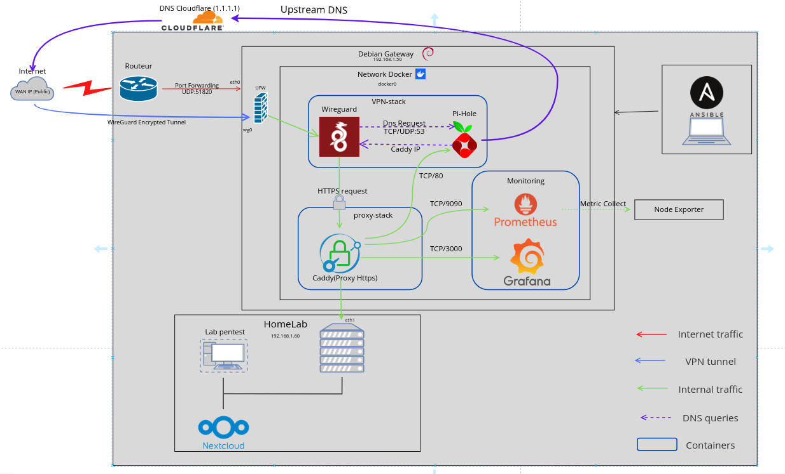

# Homelab Gateway


Une passerelle d'accès à distance sécurisée et automatisée pour Home Lab, combinant un tunnel VPN chiffré, un filtrage DNS (Sinkhole) et un Reverse Proxy moderne.

## Présentation

Ce projet permet de déployer une passerelle (Gateway) robuste pour accéder à vos services locaux (Nextcloud, serveurs de fichiers, labs de test) depuis n'importe où, sans jamais les exposer directement sur l'Internet public. 

L'infrastructure est entièrement pilotée par **Ansible** pour garantir un déploiement reproductible et sécurisé (Infrastructure as Code).

## Architecture



> **Segmentation de Sécurité (Zones & Interfaces) :**
> - **Zone WAN (DMZ Logicielle) - `eth0`** : Point d'entrée physique. Seul le port UDP/51820 est exposé. Tout trafic non authentifié est rejeté par défaut.
> - **Zone VPN (Tunnel de Confiance) - `wg0`** : Interface virtuelle de déchiffrement. Une fois le tunnel établi, le trafic est considéré comme "Trusted".
> - **Zone Services (Microservices) - `docker0 / vpn_net`** : Réseau isolé pour les conteneurs (Pi-hole, Caddy, Grafana). Communication inter-conteneurs sans exposition sur l'hôte.
> - **Zone LAN (HomeLab Physique) - `eth1`** : Interface dédiée aux ressources locales physiques (NAS, serveurs de test). Isolation totale du réseau domestique standard.

Le système repose sur quatre piliers fondamentaux :
1.  **WireGuard (VPN)** : Le tunnel chiffré haute performance pour l'accès entrant.
2.  **Pi-hole (DNS)** : Filtrage des publicités et des traqueurs pour tous les clients VPN.
3.  **Caddy (Reverse Proxy)** : Routage interne des services avec HTTPS automatique.
4.  **UFW & Fail2Ban** : Protection périmétrale et blocage des intrusions.

### Pourquoi Caddy plutôt qu'Nginx ?
Pour ce projet, le choix s'est porté sur **Caddy** pour plusieurs raisons :
*   **Simplicité de configuration** : Le `Caddyfile` est beaucoup plus lisible et rapide à configurer que les fichiers `.conf` d'Nginx.
*   **HTTPS Natif** : Caddy gère les certificats SSL automatiquement.
*   **Curiosité Technique** : Ayant déjà utilisé Nginx sur de nombreux projets précédents, l'objectif était de découvrir et d'éprouver un outil moderne et performant.

## Déploiement Rapide

### Prérequis
*   Un serveur sous **Debian 12**.
*   Accès SSH avec clé publique.
*   Ansible installé sur votre machine de contrôle.

### Installation
1.  **Cloner le dépôt** :
    ```bash
    git clone https://github.com/Antonin012/homelab-gateway.git
    cd homelab-gateway
    ```
2.  **Configurer les variables** :
    Éditez `deployments/ansible/inventory.ini` avec l'IP de votre serveur.
3.  **Sécuriser les secrets** :
    ```bash
    ansible-vault encrypt deployments/ansible/group_vars/all/secrets.yml
    ```
4.  **Lancer le déploiement** :
    ```bash
    ansible-playbook -i deployments/ansible/inventory.ini deployments/ansible/playbook.yml --ask-vault-pass
    ```

## Documentation Détaillée

Pour plus de détails sur la configuration, les tests de sécurité et l'utilisation quotidienne, consultez notre guide complet :
 **[Guide d'Installation et d'Utilisation](./docs/install.md)**

---
*Projet réalisé dans un objectif de sécurisation réseau et d'apprentissage des outils DevOps.*
